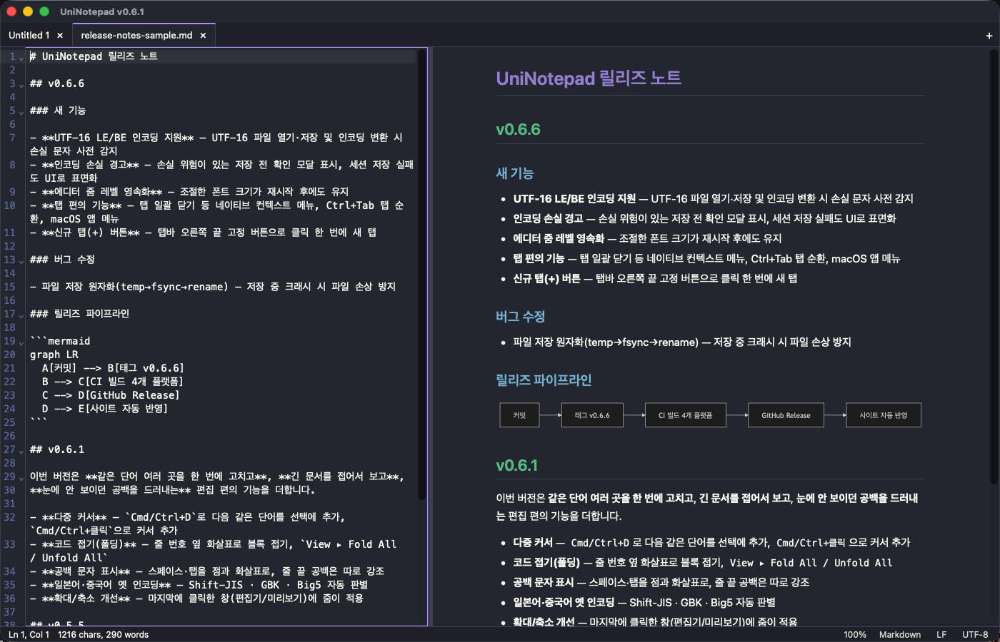
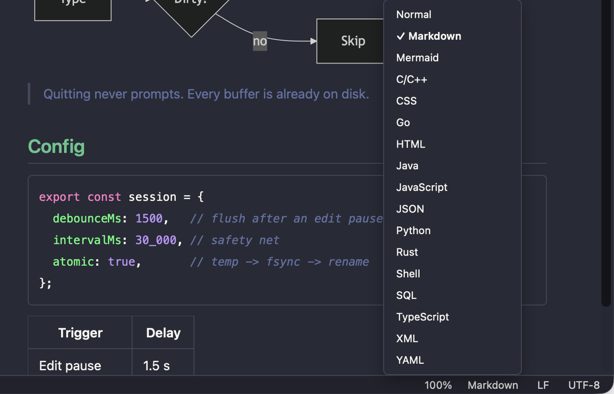
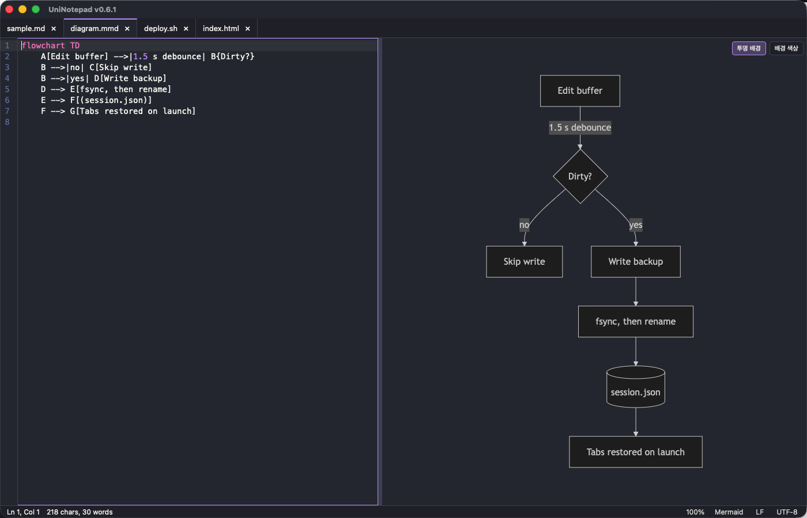
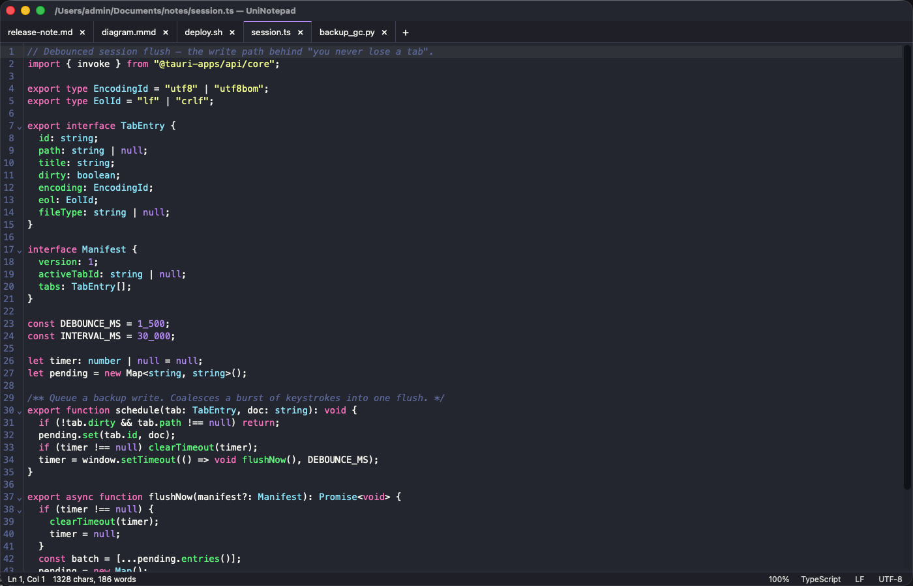
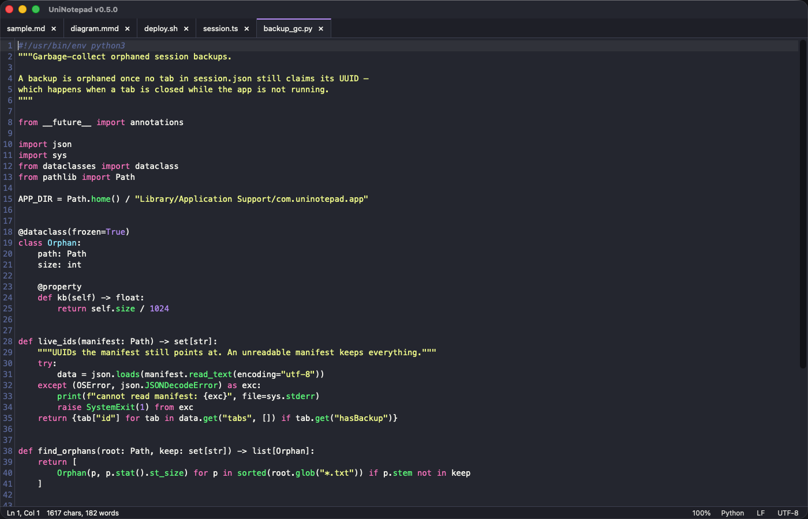
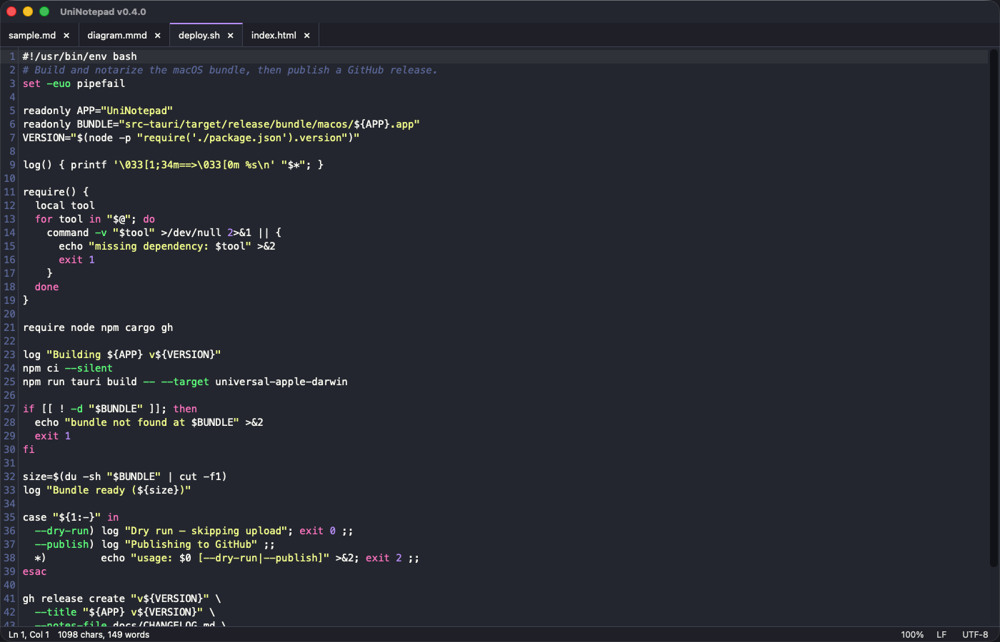

<p align="center">
  
</p>

<h1 align="center">UniNotepad</h1>

<p align="center"><b>껐다 켜도 그대로인 메모장.</b></p>

<p align="center">
  <a href="https://uninotepad-xi.vercel.app/"></a>
  <a href="https://github.com/ilphs/UniNotepad/releases/latest"></a>
  
  <a href="https://github.com/ilphs/UniNotepad/releases"></a>
  
</p>

<p align="center">
  <a href="https://uninotepad-xi.vercel.app/"></a>
</p>

메모장에 뭔가 적어두고 저장하는 걸 깜빡한 채 창을 닫아본 적 있으신가요?
아니면 컴퓨터가 갑자기 꺼져서 쓰던 내용이 날아간 적은요?

UniNotepad에서는 그런 일이 생기지 않습니다. 열어둔 탭은 **저장하지 않은 내용까지**
그대로 남아 있다가, 다음에 앱을 열면 떠날 때 모습 그대로 돌아옵니다.
앱을 종료하든, 갑자기 꺼지든, 컴퓨터를 재시작하든 똑같습니다. 저장 버튼을 누를 필요가 없습니다.

**바로가기** — [무엇이 다른가요](#-무엇이-다른가요) · [화면](#-화면) · [설치](#-설치) · [자주 묻는 질문](#-자주-묻는-질문)

## ✨ 무엇이 다른가요

| 기능 | 설명 |
|:--|:--|
| 💾 **저장 걱정 없음** | 타이핑을 멈추면 알아서 기록 — 닫을 때 "저장하시겠습니까?"를 묻지 않습니다 |
| 🗂️ **탭 · 세션 복원** | 껐다 켜도, 갑자기 꺼져도 열어둔 탭이 **미저장 메모까지** 그대로 — 탭바 **+** 버튼, Ctrl+Tab 순환, 우클릭 메뉴로 다른 탭 한꺼번에 닫기 |
| 🎨 **구문 강조** | 143개 언어를 파일 이름만 보고 자동 판별 |
| 📄 **문서 미리보기** | Markdown·Mermaid 실시간 렌더 · 스크롤 동기화 · HTML 내보내기 · 인쇄(PDF) · 편집기와 미리보기 따로 확대 — 확대 크기는 다시 켜도 유지 |
| 🌗 **라이트·다크 테마** | 시스템 설정을 따르거나 직접 선택 — 미리보기 색도 함께 바뀝니다 |
| ✂️ **줄 편집 도구** | 정렬 · 중복/빈 줄 제거 · 공백 정리 · 대소문자 · 줄 이동 (`Edit ▸ Line Operations`) |
| ⌨️ **다중 커서 · 코드 폴딩** | 같은 단어를 한꺼번에 선택해 고치고(Cmd/Ctrl+D), 긴 코드는 접어서 봅니다 — 공백 문자 표시 토글도 (`View` 메뉴) |
| 🇰🇷 **옛 인코딩 파일** | UTF-8·UTF-16은 물론 EUC-KR/CP949 · Shift-JIS · GBK · Big5도 판별해서 엽니다 — 표현할 수 없는 문자는 저장 전에 미리 경고 |
| 🪶 **가벼움** | 브라우저를 끼워 넣지 않고 OS 기능을 써서 설치 파일 **3MB 안팎** |

> Linux `.AppImage`만은 필요한 것을 전부 담느라 큽니다 — 가볍게 쓰시려면 `.deb`나 `.rpm`을 받으세요.

## 🖼 화면

밝은 테마와 어두운 테마를 모두 지원하며, 색상은 지금 쓰는 테마를 따라갑니다.

**더 많은 화면과 원클릭 다운로드는 [홈페이지](https://uninotepad-xi.vercel.app/)에서 볼 수 있습니다.**

| |
|:--|
| **파일 타입 선택** — 상태 표시줄에서 고르면 됩니다. 저장하지 않은 새 글도 Markdown이나 Mermaid로 지정하면 바로 색이 입혀지고 미리보기가 열립니다 |
| [](https://uninotepad-xi.vercel.app/) |

> 상단의 큰 화면이 **Markdown** 분할 미리보기입니다.

| | |
|:--|:--|
| **Mermaid** — 순서도를 글로 적으면 그림이 됩니다 | **TypeScript** — 타입과 제네릭까지 |
| [](https://uninotepad-xi.vercel.app/) | [](https://uninotepad-xi.vercel.app/) |
| **Python** — docstring과 데코레이터 | **Bash** — 명령어 스크립트 |
| [](https://uninotepad-xi.vercel.app/) | [](https://uninotepad-xi.vercel.app/) |

## 📥 설치

**👉 [홈페이지에서 내려받기](https://uninotepad-xi.vercel.app/#download)** — 접속한 운영체제를 자동으로 알아보고 알맞은 파일을 추천합니다.

또는 [GitHub 릴리스](https://github.com/ilphs/UniNotepad/releases/latest)에서 직접 골라 받을 수도 있습니다.

| 운영체제 | 받을 파일 |
|:--|:--|
| Windows | `UniNotepad_x.y.z_x64_en-US.msi` (또는 `x64-setup.exe`) |
| macOS — M1 이후 | `UniNotepad_x.y.z_aarch64.dmg` |
| macOS — 인텔 | `UniNotepad_x.y.z_x64.dmg` |
| Linux | `.AppImage` · `.deb` · `.rpm` 중 편한 것 |

<details>
<summary><b>macOS에서 "손상되었기 때문에 열 수 없습니다"라고 나올 때</b></summary>

<br>

이 앱은 Apple 개발자 인증서 서명·공증(notarization) 없이 배포됩니다. 그래서 내려받은
앱을 처음 열면 macOS가 "손상된 파일"이라며 열어 주지 않을 수 있습니다. 파일이 실제로
깨진 것은 아니고, 공증되지 않은 앱을 인터넷에서 받았을 때 나오는 macOS의 기본 안내입니다.

`UniNotepad.app`을 `응용 프로그램` 폴더로 옮긴 뒤, 터미널에서 아래 한 줄을 실행하고
다시 열면 됩니다. (내려받은 파일에 붙는 격리 꼬리표를 지우는 명령입니다.)

```bash
xattr -cr /Applications/UniNotepad.app
```

</details>

## ❓ 자주 묻는 질문

<details>
<summary><b>저장을 안 했는데 정말 안 없어지나요?</b></summary>

<br>

네. 타이핑을 멈추면 1.5초 뒤에, 그리고 탭을 옮기거나 창을 닫을 때마다 조용히
기록해 둡니다. 컴퓨터가 강제로 꺼져도 마지막 1~2초 분량 외에는 남아 있습니다.

</details>

<details>
<summary><b>그럼 저장 버튼은 왜 있나요?</b></summary>

<br>

앱이 알아서 보관하는 건 이 앱 안에서만 쓰는 임시 보관본입니다.
내용을 실제 파일로 남겨 다른 프로그램에서도 열려면 저장을 해야 합니다.

저장할 때는 임시 파일에 먼저 완전히 쓴 뒤 순간적으로 바꿔치기하는 방식이라,
저장 도중 컴퓨터가 꺼져도 원래 파일이 깨지지 않습니다.

</details>

<details>
<summary><b>작업하던 파일을 다른 프로그램에서 고치면요?</b></summary>

<br>

다음에 앱을 켤 때 알아채고 "파일이 바뀌었다"고 알려줍니다. 이때도 사용자가 쓰던
내용이 우선이라 멋대로 덮어쓰지 않습니다. 다만 앱이 켜져 있는 동안 실시간으로
지켜보지는 않으니, 같은 파일을 다른 프로그램과 번갈아 편집 중이라면 주의하세요.

</details>

<details>
<summary><b>탭을 실수로 닫으면요?</b></summary>

<br>

저장하지 않은 탭을 닫을 때는 저장할지 물어봅니다. 앱을 통째로 종료할 때와 달리,
탭을 닫는 건 "이제 그만 보겠다"는 분명한 의사 표시로 보기 때문입니다.

</details>

<details>
<summary><b>한글이 깨지지 않나요?</b></summary>

<br>

요즘 표준인 UTF-8 파일은 (BOM이 있든 없든) 그대로 잘 열립니다. 예전 윈도우
메모장에서 "ANSI"로 저장한 한글 파일(EUC-KR/CP949)도 알아서 판별해 제대로
엽니다. 혹시 잘못 인식되면 상태 표시줄의 인코딩 항목을 눌러 **EUC-KR**을 직접
고르면 그 인코딩으로 다시 읽어 옵니다. 줄바꿈 방식도 Windows식·Unix식을 알아서
알아본 뒤 저장할 때 원래대로 되돌려 놓습니다.

일본어(Shift-JIS)·중국어 간체(GBK)·번체(Big5)로 저장된 옛 문서도 같은 방식으로
자동 판별해 열고, 상태 표시줄에서 직접 골라 다시 읽을 수도 있습니다.
UTF-16(LE/BE) 파일도 마찬가지로 열고 저장할 수 있습니다.

지금 고른 인코딩으로 표현할 수 없는 문자가 있으면 저장하기 전에 미리 알려주므로,
모르는 사이에 글자가 깨진 채 저장되는 일이 없습니다.

</details>
