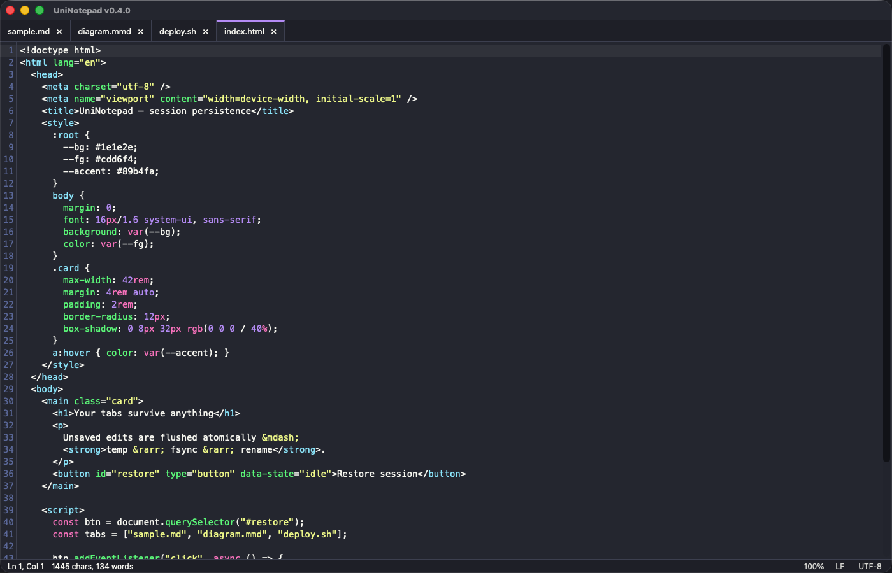

# UniNotepad

탭과 **Notepad++ 스타일 세션 지속성**을 갖춘 가볍고 크로스 플랫폼(Windows / macOS / Linux)인
플레인 텍스트 에디터입니다. 열어둔 탭은 — 저장하지 않은 편집 내용과 방금 만든 untitled
문서까지 포함해 — 앱 종료·크래시·컴퓨터 재시작을 견디고, 다음에 앱을 열면 떠날 때
그대로 되살아납니다. 수동 저장은 필요 없습니다.

## 구문 강조 (Syntax highlighting)

**143개 언어 / 224개 확장자**를 파일명만 보고 판별합니다. 모드 메뉴도, 설정도 없습니다.

자주 쓰는 언어(JSON, JS/TS, Python, C/C++, Rust, Go, HTML/CSS, Markdown, YAML, XML,
SQL, Java, shell)는 번들에 포함돼 파일을 여는 즉시 강조됩니다. 나머지는
[`@codemirror/language-data`](https://github.com/codemirror/language-data)에 매칭한 뒤
해당 언어 팩을 처음 쓸 때 별도 청크로 가져옵니다 — 그래서 롱테일 언어를 아무리 많이
지원해도 앱 시작 비용은 0입니다.

롱테일에는 웹(LESS/SCSS/Vue/Pug/Handlebars), 시스템(Swift/Objective-C/D/Fortran/Cobol/
어셈블리), JVM·.NET(Kotlin/Scala/Groovy/Clojure/C#/F#/VB.NET), 스크립트(Ruby/Perl/PHP/
Lua/PowerShell/Tcl/R/Julia), 함수형(Haskell/Elm/Erlang/OCaml/Lisp/Scheme), 데이터·설정
(TOML/INI/ProtoBuf/LaTeX/diff), 데이터베이스(Cypher/XQuery/PL-SQL 및 각종 SQL 방언),
하드웨어 기술 언어(Verilog/SystemVerilog/VHDL)가 포함됩니다.

확장자가 없는 파일은 이름으로 인식합니다: `Dockerfile`, `CMakeLists.txt`, `Jenkinsfile`,
`Gemfile`, `Rakefile`, `BUILD`, `PKGBUILD`, `nginx*.conf`.

어디에도 매칭되지 않으면 플레인 텍스트로 열립니다.

### 화면

구문 강조와 Markdown 미리보기 모두 현재 라이트/다크 테마를 따릅니다.

| | |
|:--|:--|
| **Markdown** — 입력과 동시에 갱신되는 분할 미리보기 | **Mermaid** — `.mmd` 파일은 전체가 다이어그램 하나로 렌더 |
|  |  |
| **Bash** — 주석·키워드·변수 확장 | **HTML** — 중첩된 CSS와 JavaScript |
|  |  |

## 기술 스택

- **[Tauri 2](https://tauri.app)** — Rust 백엔드 + OS 네이티브 WebView (작은 바이너리, 브라우저 미포함)
- **[CodeMirror 6](https://codemirror.dev)** — 에디터 컴포넌트. 주요 언어 팩은 번들에 포함, 나머지는 언어 단위로 lazy-load
- **Vanilla TypeScript + Vite** — 프론트엔드 프레임워크 런타임 없음

## 사전 요구사항

- [Node.js](https://nodejs.org) 18 이상
- [Rust](https://www.rust-lang.org/tools/install) (stable)
- Linux 한정: `webkit2gtk-4.1`, `libgtk-3` 개발 패키지

## 개발

```bash
npm install
npm run tauri dev      # 핫 리로드로 앱 실행
```

## 빌드

```bash
npm run tauri build    # src-tauri/target/release/bundle/ 아래에 플랫폼별 설치 파일 생성
```

## 테스트

```bash
# Rust: 인코딩 왕복 변환 + 세션 스토어 내구성 (원자적 쓰기, 손상 파일 격리, GC)
cd src-tauri && cargo test

# 프론트엔드 타입체크 + 프로덕션 번들
npm run build
```

## 세션 지속성 동작 방식

- 세션 데이터는 OS별 앱 데이터 디렉터리(`app_data_dir()`)에 저장됩니다.
  `session.json` 매니페스트 + `backups/` 아래에 dirty/untitled 탭마다 백업 파일 하나씩.
- dirty 버퍼는 편집 후 1.5초 디바운스, 탭 전환, 창 blur, 구조 변경, 30초 주기 안전장치,
  창 닫기 시점에 flush됩니다.
- 모든 쓰기는 원자적입니다(임시 파일 → fsync → rename). 그래서 `kill -9`나 정전에도
  파일이 깨지지 않으며, 최악의 경우 마지막 디바운스 구간만 유실됩니다.
- 시작 시 매니페스트를 읽어 각 탭을 디스크와 대조합니다. clean 파일은 다시 읽고,
  dirty 파일은 백업을 복원하며(사용자의 편집이 우선), 디스크에서 파일이 변경되거나
  삭제됐으면 작업을 막지 않는 배너로 알립니다.

## 동작 특성 (Notepad++ 동등성)

- **앱을 종료할 때는 아무것도 묻지 않습니다** — 전부 저장되고 복원됩니다.
- **dirty 탭을 명시적으로 닫을 때만** 저장 / 저장 안 함 / 취소를 묻습니다.

## 수동 인수 테스트 (세션 복원)

1. `npm run tauri dev`로 실행해 파일 몇 개를 열고, 하나를 편집하고, 내용이 있는 untitled 탭을 1~2개 만듭니다.
2. 프로세스를 강제 종료합니다 (`kill -9 <pid>` 또는 활성 상태 보기 / 작업 관리자).
3. 다시 실행 — 모든 탭이 순서대로 돌아오고, 활성 탭·커서 위치·dirty 표시·untitled 내용이
   그대로 유지됩니다.
