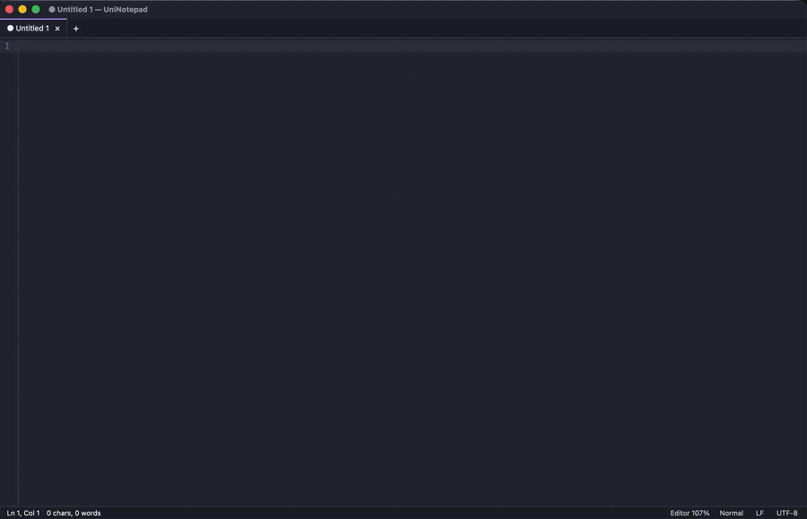
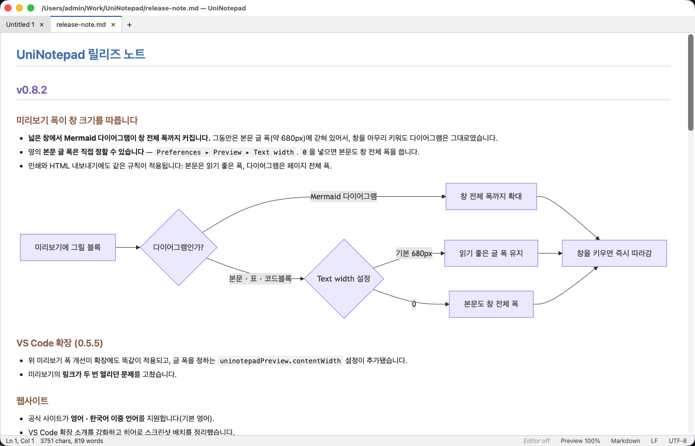
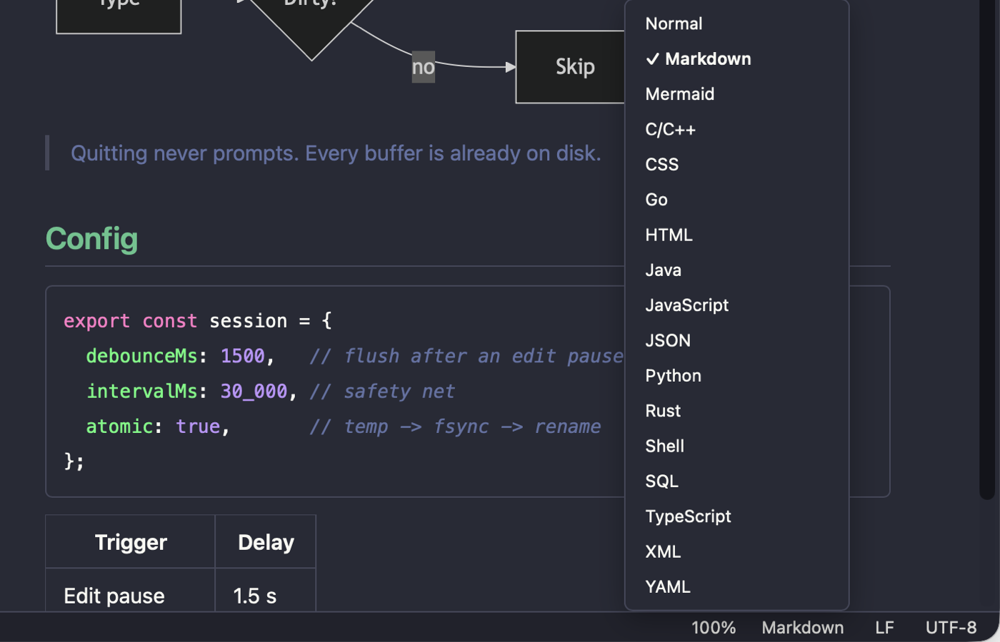
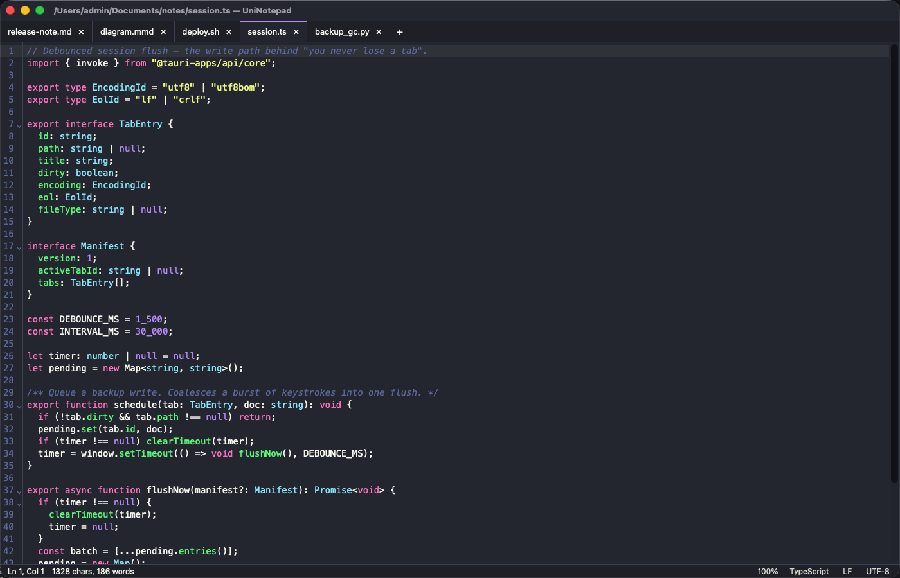
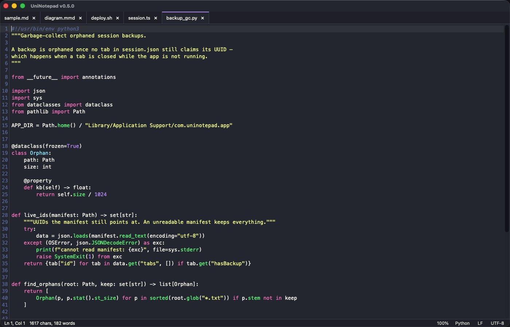
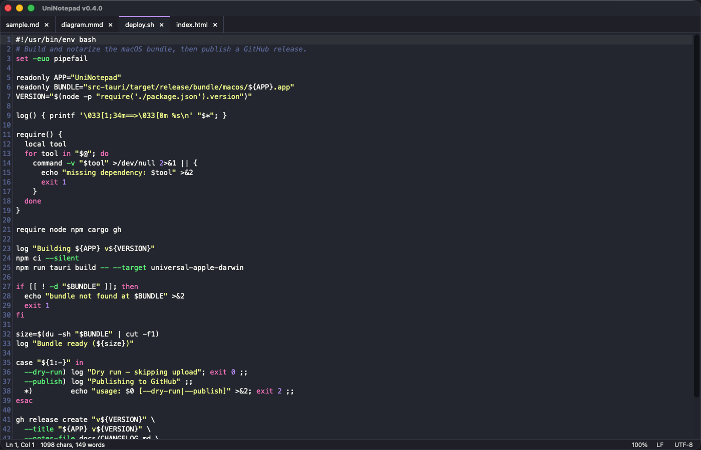

<p align="center">
  
</p>

<h1 align="center">UniNotepad</h1>

<p align="center"><b>껐다 켜도 그대로인 메모장.</b></p>

<p align="center">
  <a href="https://uninotepad-xi.vercel.app/"></a>
  <a href="https://github.com/ilphs/UniNotepad/releases/latest"></a>
  
  <a href="https://github.com/ilphs/UniNotepad/releases"></a>
  <a href="https://marketplace.visualstudio.com/items?itemName=ilphs.uninotepad-markdown-preview"></a>
  
</p>

<p align="center">
  <a href="https://uninotepad-xi.vercel.app/"></a>
</p>
<p align="center"><sub>상태 표시줄에서 <b>Markdown</b>을 고르면 미리보기가 열리고, 치는 대로 오른쪽에 렌더됩니다. 마지막에 <b>편집 창을 닫으면</b> 다이어그램이 전체 폭으로 커집니다.<br>움직임 없이 보거나 재생을 멈추려면 <a href="https://uninotepad-xi.vercel.app/">홈페이지</a>에서 같은 영상을 재생 컨트롤과 함께 볼 수 있습니다.</sub></p>

메모장에 뭔가 적어두고 저장하는 걸 깜빡한 채 창을 닫아본 적 있으신가요?
아니면 컴퓨터가 갑자기 꺼져서 쓰던 내용이 날아간 적은요?

UniNotepad에서는 그런 일이 생기지 않습니다. 열어둔 탭은 **저장하지 않은 내용까지**
그대로 남아 있다가, 다음에 앱을 열면 떠날 때 모습 그대로 돌아옵니다.
앱을 종료하든, 갑자기 꺼지든, 컴퓨터를 재시작하든 똑같습니다. 저장 버튼을 누를 필요가 없습니다.

그리고 **Markdown과 Mermaid는 쓰는 즉시 오른쪽에서 그려집니다.** 표도, 코드블록도,
순서도도 인터넷 없이 앱 안에서 바로 렌더됩니다 — 맨 위 영상이 그 모습입니다.

**색조합 10가지를 담았습니다.** Dracula · GitHub · Solarized · Gruvbox · Catppuccin ·
Nord · Tokyo Night · One Half · Rosé Pine · Kanagawa 중에 고르고, 밝게 볼지 어둡게 볼지는
따로 정합니다 — 시스템 설정을 그대로 따라가게 둘 수도 있습니다(`View ▸ Theme ▸ System`).
편집기뿐 아니라 구문 강조 색과 Markdown·Mermaid 미리보기까지 함께 바뀝니다.

**바로가기** — [무엇이 다른가요](#-무엇이-다른가요) · [VS Code 확장](#-vs-code-확장) · [테마](#-테마) · [화면](#-화면) · [설치](#-설치) · [자주 묻는 질문](#-자주-묻는-질문)

<sub>이 문서의 링크는 GitHub 정책상 항상 같은 탭에서 열립니다. 읽던 자리를 두고 싶으면 `Cmd`(macOS) 또는 `Ctrl`(Windows·Linux)을 누른 채 클릭하거나 가운데 버튼으로 누르세요 — 새 탭에서 열립니다.</sub>

## ✨ 무엇이 다른가요

| 기능 | 설명 |
|:--|:--|
| 💾 **저장 걱정 없음** | 타이핑을 멈추면 알아서 기록 — 닫을 때 "저장하시겠습니까?"를 묻지 않습니다 |
| 🗂️ **탭 · 세션 복원** | 껐다 켜도, 갑자기 꺼져도 열어둔 탭이 **미저장 메모까지** 그대로 — 탭바 **+** 버튼, Ctrl+Tab 순환, 우클릭 메뉴로 다른 탭 한꺼번에 닫기 |
| 📝 **Markdown 실시간 미리보기** | 타이핑하는 대로 오른쪽에 렌더 — GFM 표 · 체크박스 · 코드블록 색칠 · 스크롤 따라가기. `Ctrl/Cmd+Shift+M`으로 열고 닫고, 가운데 경계선을 끌어 비율 조절 — 비율·확대율은 **탭마다** 기억 |
| 🪟 **편집 창 · 미리보기 창 따로 여닫기** | 두 창을 **탭마다 각각** 켜고 끕니다 — 이 탭은 미리보기만 크게, 저 탭은 편집만. 창 오른쪽 위에 마우스를 올리면 **×** 버튼이 나타나고, 다시 열 때는 상태 표시줄의 `Editor` · `Preview`를 누르면 됩니다. 창 구성도 **탭마다** 기억됩니다 |
| 🧜 **Mermaid 다이어그램** | ` ```mermaid ` 코드블록은 물론 `.mmd` 파일도 통째로 그림으로 — 순서도·시퀀스·간트·클래스 등 [Mermaid 11](https://mermaid.js.org/)이 그리는 건 다 됩니다. 넓은 창에서는 다이어그램이 창 폭까지 커지고, 차트만 따로 확대하거나 배경색을 고를 수도 있어요 |
| 🖨️ **미리보기 내보내기** | 렌더된 문서를 HTML 한 파일로 저장하거나 그대로 인쇄(PDF) — 다이어그램도 그림째로 담깁니다 |
| 📋 **웹에서 복사 → Markdown으로 붙여넣기** | 챗봇 답변이나 웹 문서를 복사해 **Markdown 탭**에 붙이면 제목 · 목록 · 표 · 코드블록이 Markdown 문법 그대로 들어옵니다. 다른 형식 탭(`.ts`, `.log` 등)은 예전처럼 원문 그대로 — `Preferences ▸ Editor ▸ Paste HTML as Markdown`에서 끌 수 있어요 |
| 🧩 **VS Code 확장** | 같은 Mermaid 미리보기를 VS Code 안에서도 — [UniNotepad Markdown Preview](https://marketplace.visualstudio.com/items?itemName=ilphs.uninotepad-markdown-preview). 기본 미리보기를 대체하지 않고 나란히 놓입니다 |
| 🎨 **구문 강조** | 143개 언어를 파일 이름만 보고 자동 판별 |
| 🌗 **테마 10종 × 밝기** | `View ▸ Theme`에서 색조합 10가지(Dracula · GitHub · Solarized · Gruvbox · Catppuccin · Nord · Tokyo Night · One Half · Rosé Pine · Kanagawa)와 밝기(**Light · Dark · System**)를 **따로** 고릅니다 — System은 OS의 밝은/어두운 모드를 그대로 따라갑니다. 편집기·구문 강조·미리보기 색이 한꺼번에 바뀌고, 고른 값은 다음에 켤 때도 유지됩니다 |
| ✂️ **줄 편집 도구** | 정렬 · 중복/빈 줄 제거 · 공백 정리 · 대소문자 · 줄 이동 (`Edit ▸ Line Operations`) |
| ⌨️ **다중 커서 · 코드 폴딩** | 같은 단어를 한꺼번에 선택해 고치고(Cmd/Ctrl+D), 긴 코드는 접어서 봅니다 — 공백 문자 표시 토글도 (`View` 메뉴) |
| 🇰🇷 **옛 인코딩 파일** | UTF-8·UTF-16은 물론 EUC-KR/CP949 · Shift-JIS · GBK · Big5도 판별해서 엽니다 — 표현할 수 없는 문자는 저장 전에 미리 경고 |
| 👀 **외부 변경 감지** | 다른 프로그램이 파일을 고치면 켜져 있는 동안에도 바로 알아챕니다 — 편집 전이면 조용히 새로 고치고, 편집 중이면 배너로 물어봅니다 |
| 🗄️ **큰 파일도 안전하게** | 10MB가 넘는 파일은 확인 후 가볍게(구문 강조 없이) 열어 앱이 굳지 않습니다 |
| ⚙️ **한곳에서 설정** | 폰트 · 줄번호 · 들여쓰기 · 저장 옵션 · 테마를 `Ctrl/Cmd+,` 한 화면에서 |
| 🔄 **자동 업데이트 확인** | 새 버전이 나오면 상태바에 조용히 알려줍니다 — Windows·AppImage는 앱 안에서 바로 설치 |
| 🪶 **가벼움** | 브라우저를 끼워 넣지 않고 OS 기능을 써서 설치 파일 **3MB 안팎** |

> Linux `.AppImage`만은 필요한 것을 전부 담느라 큽니다 — 가볍게 쓰시려면 `.deb`나 `.rpm`을 받으세요.

## 🧩 VS Code 확장

앱의 Mermaid 미리보기를 그대로 옮긴 VS Code 확장이 따로 나와 있습니다 — VS Code
Marketplace의 [**UniNotepad Markdown Preview**](https://marketplace.visualstudio.com/items?itemName=ilphs.uninotepad-markdown-preview).
다이어그램 확대, 드래그로 밀어보기, 배경 투명/색 지정이 앱과 같은 방식으로 동작합니다.

VS Code 기본 Markdown 미리보기를 **대체하는 게 아니라 나란히** 놓입니다 — Markdown 파일
제목줄에 버튼이 하나 더 생기는데, 기본 미리보기는 원래 아이콘 그대로이고 이 확장 것은
앱의 `<>` 마름모입니다 (그 툴바에서 유일하게 색이 들어간 아이콘이라 헷갈리지 않습니다).

**설치**

| 방법 | |
|:--|:--|
| Marketplace 페이지 | [UniNotepad Markdown Preview](https://marketplace.visualstudio.com/items?itemName=ilphs.uninotepad-markdown-preview) |
| VS Code 안에서 | 확장 뷰(`Cmd/Ctrl+Shift+X`)에서 **UniNotepad Markdown Preview** 검색 |
| 터미널에서 | `code --install-extension ilphs.uninotepad-markdown-preview` |

**쓰는 법**

| 하고 싶은 것 | 방법 |
|:--|:--|
| 미리보기 열기 | `Cmd/Ctrl+K Shift+M`, 또는 편집기 제목줄의 `<>` 마름모 아이콘 |
| 확대 · 축소 · 원래대로 | `Cmd/Ctrl` + `=` `-` `0` (미리보기 패널에 포커스가 있을 때) — 글자와 다이어그램이 함께 커집니다 |
| 확대한 다이어그램 밀어보기 | 다이어그램 안에서 클릭한 채 끌기 |
| 다이어그램 배경 바꾸기 | 다이어그램에 마우스를 올리면 나오는 **Transparent** · **Backdrop** |
| HTML로 내보내기 | 명령 팔레트 ▸ **UniNotepad: Export Preview as HTML** |

- `.md`는 물론 `.mmd` · `.mermaid` 파일도 열립니다 — 앱과 마찬가지로 문서 전체가 하나의 큰 다이어그램이 됩니다
- 미리보기 패널은 하나이고 **활성 편집기를 따라갑니다**. 다른 Markdown 파일로 옮기면 미리보기도 따라 바뀌고, 렌더할 수 없는 편집기(`.ts` 파일 등)로 옮겨도 화면을 비우지 않고 마지막 렌더를 그대로 둡니다
- 다이어그램 배경과 스크롤 동기화는 VS Code 설정의 `uninotepadPreview.*` 세 항목으로도 조정할 수 있습니다

**앱과 다른 점**

확장은 VS Code 웹뷰 안에서 돌아가기 때문에 앱에서 되는 몇 가지가 빠져 있습니다 — 버그가 아니라 이 버전의 한계입니다.

- **코드블록에 구문 강조가 없습니다** — 앱은 언어별 문법을 그때그때 불러오는데, 웹뷰의 보안 정책(CSP)이 그 방식을 막습니다
- **인쇄가 안 됩니다** — 웹뷰에서는 인쇄 창을 띄울 수 없습니다. HTML로 내보낸 뒤 브라우저에서 인쇄하세요 (내보내기 명령이 그 파일을 열어 줄지 물어봅니다)
- **`#앵커` 링크는 대부분 동작하지 않습니다** — 제목에 붙는 id가 만들어지지 않아 이동할 자리가 없습니다
- 스크롤 동기화는 **편집기 → 미리보기 한 방향**입니다 (앱과 같습니다)

확장 쪽 문서와 개발 안내는 [`vscode-ext/README.md`](vscode-ext/README.md)에 있습니다.

## 🌗 테마

| |
|:--|
| [](https://uninotepad-xi.vercel.app/) |
| 라이트 테마 — 맨 위 영상과 같은 문서를 밝은 테마로 본 모습입니다. 여기서는 **편집 창을 닫아** 미리보기가 창 전체 폭을 쓰고 있습니다 (상태 표시줄의 `Editor`가 `off`) |

테마와 밝기는 **따로 고릅니다.** 좋아하는 색조합을 정해 두고, 밝게 볼지 어둡게 볼지는
그날그날 바꿀 수 있습니다.

| 하고 싶은 것 | 방법 |
|:--|:--|
| 색조합 고르기 | `View ▸ Theme` 위쪽 — Dracula · GitHub · Solarized · Gruvbox · Catppuccin · Nord · Tokyo Night · One Half · Rosé Pine · Kanagawa |
| 밝기 고르기 | `View ▸ Theme` 아래쪽 — **Light / Dark / System** |
| 설정 화면에서 바꾸기 | `Ctrl/Cmd + ,` ▸ **Theme**(색조합) · **Appearance**(밝기) |
| OS 설정 따라가기 | 밝기를 **System**으로 — 시스템이 밤에 어두워지면 앱도 같이 어두워집니다 |

- 10가지 색조합에 각각 밝은 판과 어두운 판이 있습니다 (기본값은 **Dracula + Dark**)
- 고른 값은 저장되어 다음에 앱을 열어도 그대로입니다
- 편집기 배경·줄번호·선택 영역은 물론 **143개 언어의 구문 강조 색**이 테마에 맞춰 바뀝니다
- **Markdown·Mermaid 미리보기도 함께** 바뀝니다 — 다이어그램은 테마가 바뀔 때 다시 그려집니다
- 다만 **인쇄와 HTML 내보내기는 항상 밝은 배경**으로 나갑니다 (종이·공유 문서에서 읽기 좋도록)

## 🖼 화면

밝은 테마와 어두운 테마를 모두 지원하며, 색상은 지금 쓰는 테마를 따라갑니다.

**더 많은 화면과 원클릭 다운로드는 [홈페이지](https://uninotepad-xi.vercel.app/)에서 볼 수 있습니다.**

| |
|:--|
| **파일 타입 선택** — 상태 표시줄에서 고르면 됩니다. 저장하지 않은 새 글도 Markdown이나 Mermaid로 지정하면 바로 색이 입혀지고 미리보기가 열립니다 |
| [](https://uninotepad-xi.vercel.app/) |

> **Markdown·Mermaid 미리보기**가 실제로 움직이는 모습은 맨 위 영상에, 라이트 테마 화면은 [테마](#-테마) 항목에 있습니다.

| | |
|:--|:--|
| **TypeScript** — 타입과 제네릭까지 | **Python** — docstring과 데코레이터 |
| [](https://uninotepad-xi.vercel.app/) | [](https://uninotepad-xi.vercel.app/) |
| **Bash** — 명령어 스크립트 | |
| [](https://uninotepad-xi.vercel.app/) | |

## 📥 설치

**👉 [홈페이지에서 내려받기](https://uninotepad-xi.vercel.app/#download)** — 접속한 운영체제를 자동으로 알아보고 알맞은 파일을 추천합니다.

또는 [GitHub 릴리스](https://github.com/ilphs/UniNotepad/releases/latest)에서 직접 골라 받을 수도 있습니다.

| 운영체제 | 받을 파일 |
|:--|:--|
| Windows | `UniNotepad_x.y.z_x64_en-US.msi` (또는 `x64-setup.exe`) |
| macOS — M1 이후 | `UniNotepad_x.y.z_aarch64.dmg` |
| macOS — 인텔 | `UniNotepad_x.y.z_x64.dmg` |
| Linux | `.AppImage` · `.deb` · `.rpm` 중 편한 것 |

<details>
<summary><b>macOS에서 "손상되었기 때문에 열 수 없습니다"라고 나올 때</b></summary>

<br>

이 앱은 Apple 개발자 인증서 서명·공증(notarization) 없이 배포됩니다. 그래서 내려받은
앱을 처음 열면 macOS가 "손상된 파일"이라며 열어 주지 않을 수 있습니다. 파일이 실제로
깨진 것은 아니고, 공증되지 않은 앱을 인터넷에서 받았을 때 나오는 macOS의 기본 안내입니다.

`UniNotepad.app`을 `응용 프로그램` 폴더로 옮긴 뒤, 터미널에서 아래 한 줄을 실행하고
다시 열면 됩니다. (내려받은 파일에 붙는 격리 꼬리표를 지우는 명령입니다.)

```bash
xattr -cr /Applications/UniNotepad.app
```

</details>

## ❓ 자주 묻는 질문

<details>
<summary><b>저장을 안 했는데 정말 안 없어지나요?</b></summary>

<br>

네. 타이핑을 멈추면 1.5초 뒤에, 그리고 탭을 옮기거나 창을 닫을 때마다 조용히
기록해 둡니다. 컴퓨터가 강제로 꺼져도 마지막 1~2초 분량 외에는 남아 있습니다.

</details>

<details>
<summary><b>그럼 저장 버튼은 왜 있나요?</b></summary>

<br>

앱이 알아서 보관하는 건 이 앱 안에서만 쓰는 임시 보관본입니다.
내용을 실제 파일로 남겨 다른 프로그램에서도 열려면 저장을 해야 합니다.

저장할 때는 임시 파일에 먼저 완전히 쓴 뒤 순간적으로 바꿔치기하는 방식이라,
저장 도중 컴퓨터가 꺼져도 원래 파일이 깨지지 않습니다.

</details>

<details>
<summary><b>작업하던 파일을 다른 프로그램에서 고치면요?</b></summary>

<br>

앱이 켜져 있는 동안에도 실시간으로 알아챕니다. 아직 손대지 않은 탭이면 조용히
새 내용을 불러오고, 편집 중인 탭이면 배너로 알려서 어느 쪽을 남길지 직접 고르게
합니다. 사용자가 쓰던 내용이 우선이라 멋대로 덮어쓰지 않는 건 그대로입니다.

</details>

<details>
<summary><b>탭을 실수로 닫으면요?</b></summary>

<br>

저장하지 않은 탭을 닫을 때는 저장할지 물어봅니다. 앱을 통째로 종료할 때와 달리,
탭을 닫는 건 "이제 그만 보겠다"는 분명한 의사 표시로 보기 때문입니다.

</details>

<details>
<summary><b>Markdown 미리보기가 안 보여요</b></summary>

<br>

미리보기는 파일 종류가 Markdown이나 Mermaid일 때만 열립니다. 아직 저장하지 않은
새 글이라면 앱이 종류를 알 수 없으니, 상태 표시줄의 파일 타입을 눌러 **Markdown**
(또는 **Mermaid**)으로 골라 주세요. 그래도 안 보이면 `Ctrl/Cmd + Shift + M`으로
미리보기가 꺼져 있는지 확인하시면 됩니다.

</details>

<details>
<summary><b>다이어그램을 그리려면 인터넷이 필요한가요?</b></summary>

<br>

아니요. Mermaid 렌더링은 전부 앱 안에서 이루어집니다. 비행기 안에서도, 사내망에서도
똑같이 그려지고, 문서 내용이 밖으로 나가지 않습니다. HTML로 내보낸 파일도 다이어그램이
그림째 들어 있어서 인터넷 없이 열립니다.

</details>

<details>
<summary><b>한글이 깨지지 않나요?</b></summary>

<br>

요즘 표준인 UTF-8 파일은 (BOM이 있든 없든) 그대로 잘 열립니다. 예전 윈도우
메모장에서 "ANSI"로 저장한 한글 파일(EUC-KR/CP949)도 알아서 판별해 제대로
엽니다. 혹시 잘못 인식되면 상태 표시줄의 인코딩 항목을 눌러 **EUC-KR**을 직접
고르면 그 인코딩으로 다시 읽어 옵니다. 줄바꿈 방식도 Windows식·Unix식을 알아서
알아본 뒤 저장할 때 원래대로 되돌려 놓습니다.

일본어(Shift-JIS)·중국어 간체(GBK)·번체(Big5)로 저장된 옛 문서도 같은 방식으로
자동 판별해 열고, 상태 표시줄에서 직접 골라 다시 읽을 수도 있습니다.
UTF-16(LE/BE) 파일도 마찬가지로 열고 저장할 수 있습니다.

지금 고른 인코딩으로 표현할 수 없는 문자가 있으면 저장하기 전에 미리 알려주므로,
모르는 사이에 글자가 깨진 채 저장되는 일이 없습니다.

</details>
