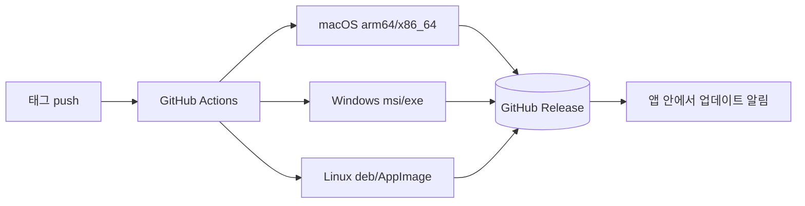

# UniNotepad 릴리즈 노트

## v0.7.1

### 개선

- **미리보기 본문이 패널 폭을 따라갑니다** — 가운데 경계선을 오른쪽으로 끌어도
  본문이 일정 폭에서 멈추고 양옆이 빈 여백으로 남던 동작을 고쳤습니다. 이제
  좁은 패널에서는 폭을 꽉 채우고, 넓은 화면에서는 읽기 좋은 길이까지만
  늘어난 뒤 가운데 정렬됩니다. 인쇄 폭은 종전과 동일합니다.

### 기타

- 릴리즈 자산 목록에서 서명(`.sig`) 파일을 제외했습니다 — 업데이터 동작에는
  영향이 없습니다.
- README와 공식 사이트에 테마 기능 안내를 추가하고 스크린샷을 갱신했습니다.

## v0.7.0

### 새 기능

- **외부 변경 실시간 감지** — 다른 프로그램이 파일을 고치면 앱이 켜져 있는
  동안에도 바로 알아챕니다. 편집 전이면 조용히 새로 고치고, 편집 중이면
  배너로 어느 쪽을 남길지 물어봅니다.
- **대용량 파일 보호** — 10MB가 넘는 파일은 확인 후 구문 강조 없이 가볍게
  열고, 100MB를 넘으면 열지 않아 앱이 멈추는 일을 막습니다.
- **자동 업데이트 확인** — 새 버전이 나오면 상태바에 조용히 알려줍니다.
  Windows·Linux AppImage는 앱 안에서 바로 설치하고 재시작합니다.
- **통합 설정 화면** — `Ctrl/Cmd+,` 한 화면에서 폰트(글꼴 선택 포함) ·
  줄번호 · 들여쓰기 · 저장 옵션 · 테마를 조절합니다. File 메뉴의
  Open Recent는 네이티브 서브메뉴가 되었습니다.

### 개선

- **초기 로드 55% 경량화** — 구문 강조 언어를 필요할 때만 로드해 시작이
  더 빨라졌습니다.
- 타이틀바에 파일 전체 경로를 표시하고, 앱 버전은 About 다이얼로그로
  옮겼습니다.

### 버그 수정

- 처음 설치했을 때 글자가 아주 작게(8px) 나오던 문제를 고쳤습니다 —
  들여쓰기 폭도 함께 영향을 받았습니다.
- About 다이얼로그의 홈페이지 링크가 열리지 않던 문제를 고쳤습니다.

## v0.6.8

### 고침

- **Windows: 메뉴 단축키가 전혀 동작하지 않던 문제를 수정했습니다** —
  `Ctrl+S/N/O/W/P`, `Ctrl+1~9`, `Ctrl+H`, `Alt+Z`, `F3` 등. 두 가지 원인
  (비어 있던 accelerator 테이블, WebView2 포커스 중 키 입력이 네이티브 메뉴에
  전달되지 않는 문제)을 모두 해결했습니다.

### 웹사이트

- 스크린샷 확대 보기에서 닫지 않고도 이전/다음 스크린샷으로 넘어갈 수 있습니다.

### 내부

- CI에 릴리즈 없이 테스트 빌드를 뽑는 수동 실행 트리거를 추가했습니다.
