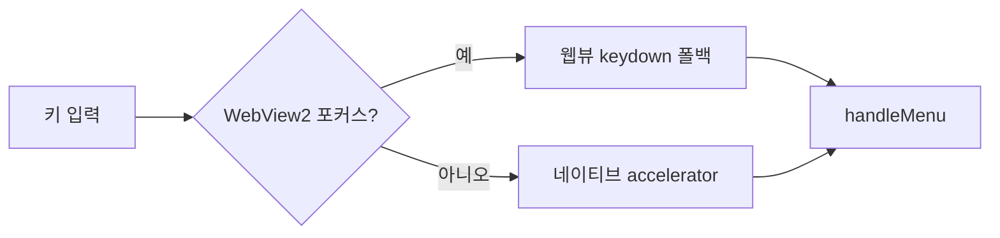

# UniNotepad 릴리즈 노트

## v0.6.8

### 고침

- **Windows: 메뉴 단축키가 전혀 동작하지 않던 문제를 수정했습니다** —
  `Ctrl+S/N/O/W/P`, `Ctrl+1~9`, `Ctrl+H`, `Alt+Z`, `F3` 등. 두 가지 원인
  (비어 있던 accelerator 테이블, WebView2 포커스 중 키 입력이 네이티브 메뉴에
  전달되지 않는 문제)을 모두 해결했습니다.

### 웹사이트

- 스크린샷 확대 보기에서 닫지 않고도 이전/다음 스크린샷으로 넘어갈 수 있습니다.

### 내부

- CI에 릴리즈 없이 테스트 빌드를 뽑는 수동 실행 트리거를 추가했습니다.

## v0.6.7

### UI 개선

- 신규 탭(+) 버튼이 탭바 오른쪽 끝 고정 대신 **마지막 탭 바로 오른쪽에 붙도록**
  개선했습니다 (Chrome과 동일한 동작). 탭이 많아져 탭바가 넘칠 때는 탭 영역이
  스크롤되고 + 버튼은 오른쪽 끝에 유지됩니다.

## v0.6.6

이번 버전은 **UTF-16 파일을 열고 저장할 수 있게** 되고, 인코딩 때문에
**글자가 깨진 채 저장되는 일을 미리 막아 줍니다.**

### 새 기능

- **UTF-16 LE/BE 인코딩 지원** — UTF-16으로 저장된 파일을 자동 판별해 열고,
  원래 인코딩 그대로 저장합니다.
- **인코딩 손실 경고** — 지금 고른 인코딩으로 표현할 수 없는 문자가 있으면
  저장하기 전에 확인 모달로 미리 알려줍니다.
- **에디터 줌 레벨 영속화** — `View ▸ Zoom In / Zoom Out`으로 조절한 글자 크기가
  앱을 껐다 켜도 그대로 유지됩니다.
- **탭 편의 기능** — 우클릭 일괄 조작 메뉴, **`Ctrl+Tab`** 탭 순환,
  macOS 표준 앱 메뉴, 클릭 한 번으로 새 탭을 여는 **신규 탭(+) 버튼**.

### 버그 수정

- **파일 저장 원자화** — temp→fsync→rename으로 저장 도중 컴퓨터가 꺼져도
  원래 파일이 깨지지 않습니다.
