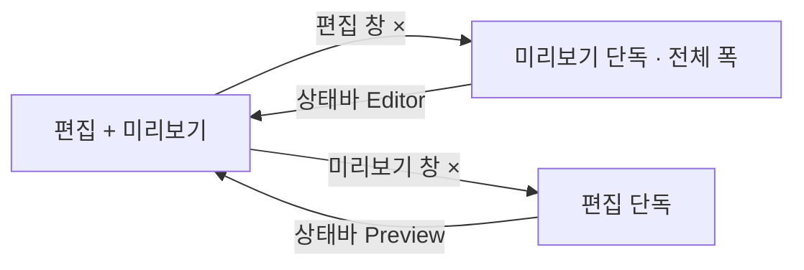

# UniNotepad 릴리즈 노트

## v0.8.0

### 새 기능

- **편집 창·미리보기 창을 탭마다 따로 여닫기** — Markdown·Mermaid 탭에서 두 창을
  각각 켜고 끌 수 있습니다. 이 탭은 미리보기만 크게, 저 탭은 편집만 — 창 구성이
  탭마다 따로 기억되고 앱을 껐다 켜도 그대로 유지됩니다.
- **창 닫기 버튼** — 각 창 오른쪽 위에 마우스를 올리면 **×** 버튼이 나타납니다.
  닫은 창은 하단 상태 표시줄의 `Editor` · `Preview`를 눌러 다시 엽니다(닫혀
  있는 동안은 `off`로 흐리게 표시됩니다). 마지막 남은 창에는 닫기 버튼이
  나타나지 않아 빈 화면이 되는 일은 없습니다.
- **미리보기 단독일 때 전체 폭 사용** — 편집 창을 닫으면 미리보기가 분할 비율을
  따르지 않고 창 전체를 채우고, 본문도 폭에 맞춰 넓어집니다.

```mermaid
graph LR
  A[편집 + 미리보기] -->|편집 창 ×| B[미리보기 단독 · 전체 폭]
  A -->|미리보기 창 ×| C[편집 단독]
  B -->|상태바 Editor| A
  C -->|상태바 Preview| A
```

### 버그 수정

- **탭별 분할 비율·확대율이 재시작 후 초기화되던 문제** — v0.7.2에서 추가한
  탭별 레이아웃 기억이 세션 저장 과정에서 유실되어, 탭을 전환할 때만 유지되고
  앱을 다시 켜면 항상 기본값으로 돌아가던 문제를 고쳤습니다.

### 기타

- 공식 사이트 랜딩 페이지를 네오브루탈리즘 스타일로 리디자인했습니다.

## v0.7.2

### 새 기능

- **탭별 레이아웃·확대율 기억** — 편집 창과 미리보기 창의 분할 비율, 그리고
  확대율을 탭마다 따로 저장합니다. 탭을 전환하면 각 탭이 갖고 있던 레이아웃·
  확대 상태로 복원되고, 앱을 껐다 켜거나 갑자기 종료된 뒤에도 그대로 유지됩니다.
- **편집기·미리보기 확대 분리** — 편집기와 미리보기의 확대율을 각각 독립적으로
  조절할 수 있습니다(마크다운 미리보기 텍스트 확대를 새로 지원). 하단 상태바에
  `Editor N%` / `Preview N%`로 나뉘어 표시됩니다.

## v0.7.1

### 개선

- **미리보기 본문이 패널 폭을 따라갑니다** — 가운데 경계선을 오른쪽으로 끌어도
  본문이 일정 폭에서 멈추고 양옆이 빈 여백으로 남던 동작을 고쳤습니다. 이제
  좁은 패널에서는 폭을 꽉 채우고, 넓은 화면에서는 읽기 좋은 길이까지만
  늘어난 뒤 가운데 정렬됩니다. 인쇄 폭은 종전과 동일합니다.

### 기타

- 릴리즈 자산 목록에서 서명(`.sig`) 파일을 제외했습니다 — 업데이터 동작에는
  영향이 없습니다.
- README와 공식 사이트에 테마 기능 안내를 추가하고 스크린샷을 갱신했습니다.
