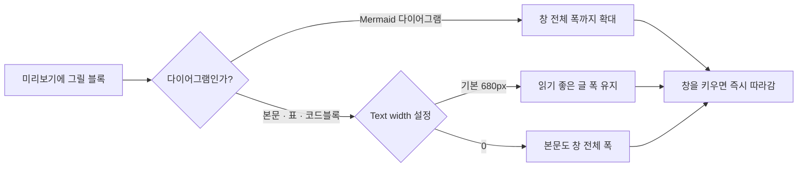
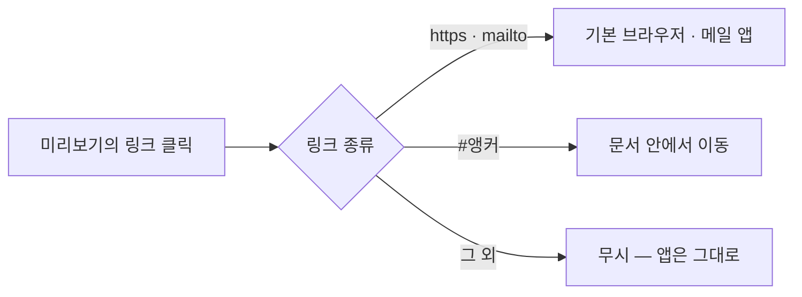
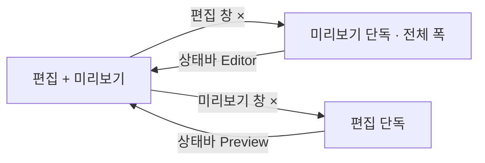
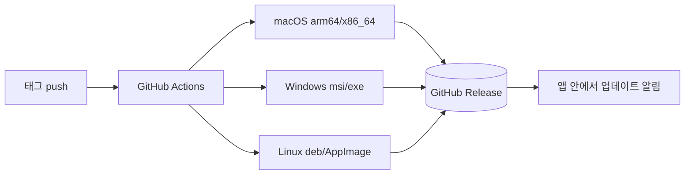

# UniNotepad 릴리즈 노트

## v0.8.2

### 미리보기 폭이 창 크기를 따릅니다

- **넓은 창에서 Mermaid 다이어그램이 창 전체 폭까지 커집니다.** 그동안은 본문 글
  폭(약 680px)에 갇혀 있어서, 창을 아무리 키워도 다이어그램은 그대로였습니다.
- 옆의 **본문 글 폭은 직접 정할 수 있습니다** — `Preferences ▸ Preview ▸ Text
  width`. `0`을 넣으면 본문도 창 전체 폭을 씁니다.
- 인쇄와 HTML 내보내기에도 같은 규칙이 적용됩니다: 본문은 읽기 좋은 폭, 다이어그램은
  페이지 전체 폭.

```mermaid
graph LR
  A[미리보기에 그릴 블록] --> B{다이어그램인가?}
  B -->|Mermaid 다이어그램| C[창 전체 폭까지 확대]
  B -->|본문 · 표 · 코드블록| D{Text width 설정}
  D -->|기본 680px| E[읽기 좋은 글 폭 유지]
  D -->|0| F[본문도 창 전체 폭]
  C --> G[창을 키우면 즉시 따라감]
  E --> G
  F --> G
```

### VS Code 확장 (0.5.5)

- 위 미리보기 폭 개선이 확장에도 똑같이 적용되고, 글 폭을 정하는
  `uninotepadPreview.contentWidth` 설정이 추가됐습니다.
- 미리보기의 **링크가 두 번 열리던 문제**를 고쳤습니다.
- 설치: [UniNotepad Markdown Preview — VS Code Marketplace](https://marketplace.visualstudio.com/items?itemName=ilphs.uninotepad-markdown-preview)

### 웹사이트

- 공식 사이트가 **영어 · 한국어 이중 언어**를 지원합니다(기본 영어).
- VS Code 확장 소개를 강화하고 히어로 스크린샷 배치를 정리했습니다.

## v0.8.1

### 버그 수정

- **미리보기에서 링크를 누르면 앱 화면이 사라지던 문제** — 렌더된 문서 안의 웹
  링크를 클릭하면 앱 창이 그 사이트로 통째로 바뀌었습니다. 뒤로 갈 방법이 없어
  앱을 다시 켜는 것이 유일한 복구였습니다. 이제 웹 링크는 **기본 브라우저**에서
  열리고, 문서 안 `#앵커` 링크는 그 자리로 이동합니다.

```mermaid
graph LR
  A[미리보기의 링크 클릭] --> B{링크 종류}
  B -->|https · mailto| C[기본 브라우저 · 메일 앱]
  B -->|#앵커| D[문서 안에서 이동]
  B -->|그 외| E[무시 — 앱은 그대로]
```

### 함께 나온 것

- **VS Code 확장 출시** — UniNotepad의 Mermaid 미리보기를 VS Code 안에서 그대로
  쓰는 [UniNotepad Markdown Preview](https://marketplace.visualstudio.com/items?itemName=ilphs.uninotepad-markdown-preview)를 Marketplace에 공개했습니다. 다이어그램
  확대 · 드래그로 밀어보기 · 배경 투명/색 지정이 앱과 같은 방식으로 동작하며,
  앱과는 별개로 설치합니다.
- README에 VS Code 확장 섹션(설치 · 사용법 · 앱과 다른 점)을 추가하고, 랜딩
  페이지에 확장 안내와 macOS 격리 꼬리표(`xattr`) 해결 카드를 넣었습니다.

## v0.8.0

### 새 기능

- **편집 창·미리보기 창을 탭마다 따로 여닫기** — Markdown·Mermaid 탭에서 두 창을
  각각 켜고 끌 수 있습니다. 이 탭은 미리보기만 크게, 저 탭은 편집만 — 창 구성이
  탭마다 따로 기억되고 앱을 껐다 켜도 그대로 유지됩니다.
- **창 닫기 버튼** — 각 창 오른쪽 위에 마우스를 올리면 **×** 버튼이 나타납니다.
  닫은 창은 하단 상태 표시줄의 `Editor` · `Preview`를 눌러 다시 엽니다(닫혀
  있는 동안은 `off`로 흐리게 표시됩니다). 마지막 남은 창에는 닫기 버튼이
  나타나지 않아 빈 화면이 되는 일은 없습니다.
- **미리보기 단독일 때 전체 폭 사용** — 편집 창을 닫으면 미리보기가 분할 비율을
  따르지 않고 창 전체를 채우고, 본문도 폭에 맞춰 넓어집니다.

```mermaid
graph LR
  A[편집 + 미리보기] -->|편집 창 ×| B[미리보기 단독 · 전체 폭]
  A -->|미리보기 창 ×| C[편집 단독]
  B -->|상태바 Editor| A
  C -->|상태바 Preview| A
```

### 버그 수정

- **탭별 분할 비율·확대율이 재시작 후 초기화되던 문제** — v0.7.2에서 추가한
  탭별 레이아웃 기억이 세션 저장 과정에서 유실되어, 탭을 전환할 때만 유지되고
  앱을 다시 켜면 항상 기본값으로 돌아가던 문제를 고쳤습니다.

### 기타

- 공식 사이트 랜딩 페이지를 네오브루탈리즘 스타일로 리디자인했습니다.

## v0.7.2

### 새 기능

- **탭별 레이아웃·확대율 기억** — 편집 창과 미리보기 창의 분할 비율, 그리고
  확대율을 탭마다 따로 저장합니다. 탭을 전환하면 각 탭이 갖고 있던 레이아웃·
  확대 상태로 복원되고, 앱을 껐다 켜거나 갑자기 종료된 뒤에도 그대로 유지됩니다.
- **편집기·미리보기 확대 분리** — 편집기와 미리보기의 확대율을 각각 독립적으로
  조절할 수 있습니다(마크다운 미리보기 텍스트 확대를 새로 지원). 하단 상태바에
  `Editor N%` / `Preview N%`로 나뉘어 표시됩니다.

```mermaid
graph LR
  T[태그 push] --> CI[GitHub Actions]
  CI --> M[macOS arm64/x86_64]
  CI --> W[Windows msi/exe]
  CI --> L[Linux deb/AppImage]
  M --> R[(GitHub Release)]
  W --> R
  L --> R
  R --> U[앱 안에서 업데이트 알림]
```

## v0.7.1

### 개선

- **미리보기 본문이 패널 폭을 따라갑니다** — 가운데 경계선을 오른쪽으로 끌어도
  본문이 일정 폭에서 멈추고 양옆이 빈 여백으로 남던 동작을 고쳤습니다. 이제
  좁은 패널에서는 폭을 꽉 채우고, 넓은 화면에서는 읽기 좋은 길이까지만
  늘어난 뒤 가운데 정렬됩니다. 인쇄 폭은 종전과 동일합니다.

### 기타

- 릴리즈 자산 목록에서 서명(`.sig`) 파일을 제외했습니다 — 업데이터 동작에는
  영향이 없습니다.
- README와 공식 사이트에 테마 기능 안내를 추가하고 스크린샷을 갱신했습니다.

## v0.7.0

### 새 기능

- **외부 변경 실시간 감지** — 다른 프로그램이 파일을 고치면 앱이 켜져 있는
  동안에도 바로 알아챕니다. 편집 전이면 조용히 새로 고치고, 편집 중이면
  배너로 어느 쪽을 남길지 물어봅니다.
- **대용량 파일 보호** — 10MB가 넘는 파일은 확인 후 구문 강조 없이 가볍게
  열고, 100MB를 넘으면 열지 않아 앱이 멈추는 일을 막습니다.
- **자동 업데이트 확인** — 새 버전이 나오면 상태바에 조용히 알려줍니다.
  Windows·Linux AppImage는 앱 안에서 바로 설치하고 재시작합니다.
- **통합 설정 화면** — `Ctrl/Cmd+,` 한 화면에서 폰트(글꼴 선택 포함) ·
  줄번호 · 들여쓰기 · 저장 옵션 · 테마를 조절합니다. File 메뉴의
  Open Recent는 네이티브 서브메뉴가 되었습니다.

### 개선

- **초기 로드 55% 경량화** — 구문 강조 언어를 필요할 때만 로드해 시작이
  더 빨라졌습니다.
- 타이틀바에 파일 전체 경로를 표시하고, 앱 버전은 About 다이얼로그로
  옮겼습니다.

### 버그 수정

- 처음 설치했을 때 글자가 아주 작게(8px) 나오던 문제를 고쳤습니다 —
  들여쓰기 폭도 함께 영향을 받았습니다.
- About 다이얼로그의 홈페이지 링크가 열리지 않던 문제를 고쳤습니다.
