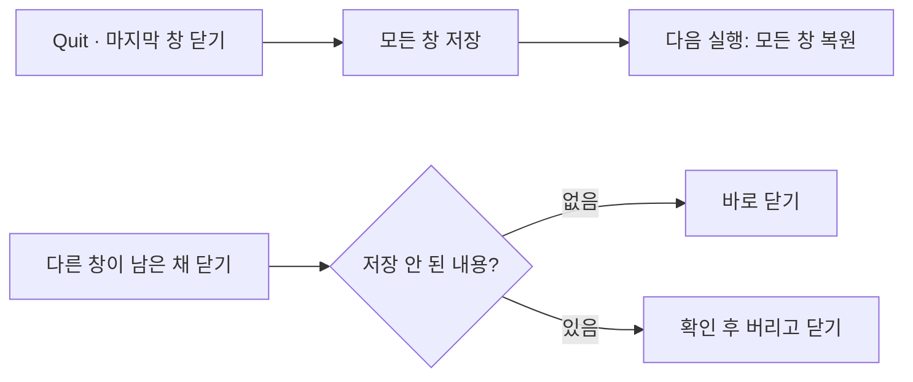
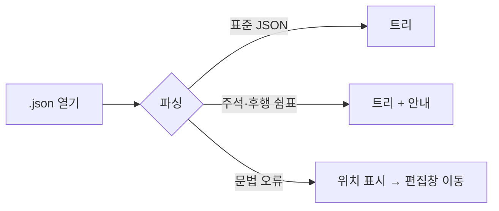
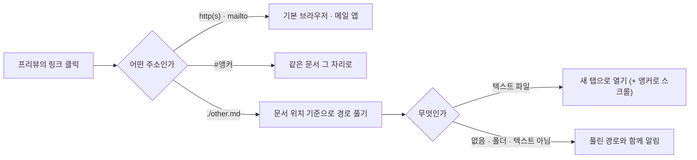
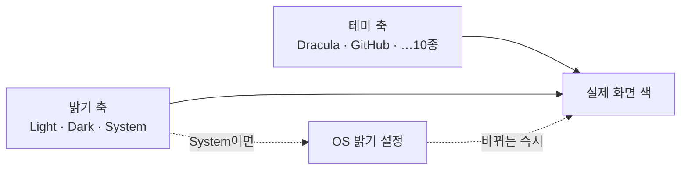
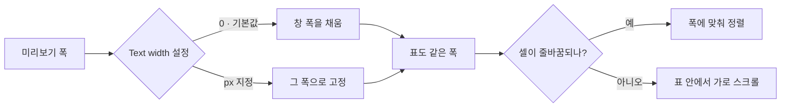
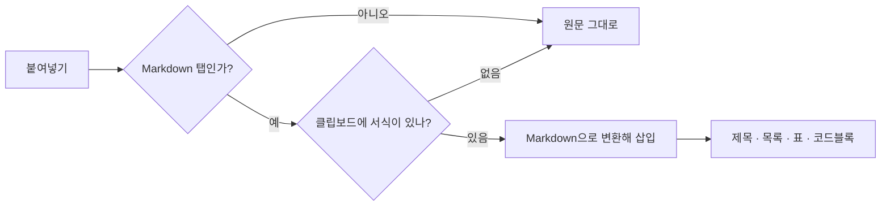
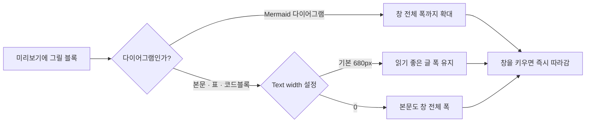
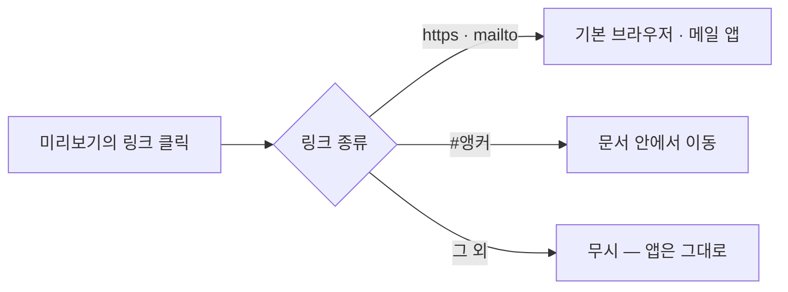
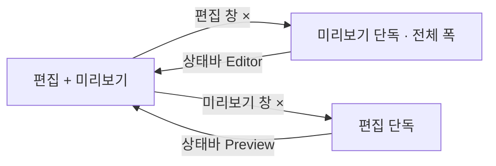
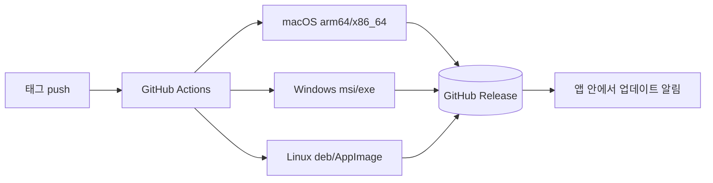

# UniNotepad 릴리즈 노트

## v0.11.0

### 창을 여러 개 띄웁니다

- `Cmd/Ctrl+N`으로 **새 창**. 창마다 자기 탭을 갖습니다.
- 종료했다 다시 켜면 **모든 창이 제자리에**, 미저장 메모까지 그대로 돌아옵니다.
- `Cmd/Ctrl+Shift+W`로 창 닫기 — 마지막 창이면 지금처럼 묻지 않고 저장하고,
  다른 창이 남아 있으면 저장 안 된 내용이 있을 때만 "버리고 닫을까요?"를 묻습니다.
- 이미 다른 창에 열린 파일을 열면 **그 창의 탭으로 이동**합니다 — 같은 파일이
  두 곳에서 따로 편집되지 않습니다.
- 한 창에서 바꾼 테마 · 줄바꿈 · 폰트 등 설정은 **다른 창에도 바로** 반영됩니다.
- macOS: **Window 메뉴**(최소화 · 확대/축소 · 열린 창 목록).

### 탭 · 창 단축키가 Ghostty와 같아졌습니다

| 동작 | 이전 | 이제 |
|:--|:--|:--|
| 새 탭 | `Cmd/Ctrl+N` | **`Cmd/Ctrl+T`** |
| 새 창 | — | **`Cmd/Ctrl+N`** |
| 창 닫기 | — | **`Cmd/Ctrl+Shift+W`** |

닫은 탭 다시 열기(`Cmd/Ctrl+Shift+T`)는 그대로입니다. `Cmd/Ctrl+N`으로 새 탭을
열던 분은 이제 새 창이 뜹니다.

```mermaid
graph LR
  Q["Quit · 마지막 창 닫기"] --> S["모든 창 저장"] --> R["다음 실행: 모든 창 복원"]
  C["다른 창이 남은 채 닫기"] --> U{"저장 안 된 내용?"}
  U -->|없음| D["바로 닫기"]
  U -->|있음| K["확인 후 버리고 닫기"]
```

### VS Code 확장 (0.8.0)

- **미리보기를 여러 개** — 미리보기 제목줄의 자물쇠로 지금 문서에 고정하면
  (`[Locked] Preview …`), 다음에 여는 미리보기는 새 패널로 열립니다. 고정한 패널도
  편집 내용이 실시간으로 반영되고, 창을 다시 불러와도 고정된 채 돌아옵니다.
  고정하지 않으면 전과 똑같습니다.
- 설치: [VS Code Marketplace](https://marketplace.visualstudio.com/items?itemName=ilphs.uninotepad-markdown-preview)

### 그 밖에

- 세션 저장 형식이 창 단위로 바뀌었습니다. v0.10.0 이하로 되돌려 설치해도 탭이
  한 창에 모여 복원되고, 미저장 메모는 지워지지 않습니다.

## v0.10.0

### JSON 파일을 트리로 봅니다

`.json` 파일을 열면 오른쪽 미리보기에 **접었다 펼 수 있는 트리**가 뜹니다.
중괄호를 눈으로 세어가며 구조를 파악할 필요가 없어졌습니다.

- 값 종류마다 색이 다릅니다 — 문자열 · 숫자 · 참/거짓 · null. 색은 편집기
  구문 강조와 **같은 테마를 따르므로** 테마를 바꾸면 트리도 함께 바뀝니다.
- 배열에는 번호가 붙고, 접힌 가지는 `{…} 3 items`처럼 **몇 개가 들어 있는지**
  알려줍니다.
- 타이핑하는 중에도 **펼쳐둔 가지가 그대로 유지**됩니다.
- 아주 큰 문서는 두 단계까지만 펼쳐서 띄우고, 나머지는 펼칠 때 그립니다.

### 표준이 아닌 JSON도 그려줍니다

실제로 쓰는 JSON 파일은 표준을 벗어나는 일이 잦습니다. 주석이 달린
`tsconfig.json`이나 손으로 고치다 남은 후행 쉼표 때문에 미리보기가 아무것도
못 그리면 정작 보고 싶을 때 쓸모가 없으니, **표준보다 넓게 받아들입니다.**

- 주석(`//`, `/* */`) · 후행 쉼표 · 따옴표 없는 키 · 작은따옴표 ·
  `NaN` · `Infinity` · `undefined` · 16진수까지 그립니다.
- 다만 그런 문법을 쓴 문서는 **트리 위에 안내를 띄웁니다** — 다른 프로그램은
  이 파일을 거부할 수 있다는 뜻이니까요.
- 문법이 정말 틀린 곳은 **줄 · 칸을 눌러 편집 창의 그 자리로 바로** 갑니다.

```mermaid
graph LR
  A[".json 열기"] --> B{파싱}
  B -->|표준 JSON| C[트리]
  B -->|주석·후행 쉼표| D[트리 + 안내]
  B -->|문법 오류| E[위치 표시 → 편집창 이동]
```

내보내기(HTML) · 인쇄에서도 **접기가 그대로 동작합니다.**

### 그 밖에

- 미리보기 왼쪽 여백이 창을 넓힐수록 과하게 벌어지던 것을 **편집 창과 같은
  간격으로** 좁혔습니다.
- 랜딩 페이지 기본 언어를 한국어로 바꿨습니다.

## v0.9.3

### 미리보기의 문서 링크를 눌러 이웃 문서를 엽니다

- `[다른 문서](./other.md)`처럼 걸린 링크를 누르면 그 파일이 **새 탭으로
  열립니다.** 지금까지는 눌러도 아무 일이 없었습니다 — 미리보기가 앱 안에서
  렌더되다 보니 상대경로를 풀 기준이 없었기 때문입니다. 이제 **링크가 적힌
  문서의 위치**를 기준으로 경로를 풀어 엽니다.
- `./other.md#앵커`처럼 앵커까지 붙어 있으면 그 자리로 스크롤합니다.
- **제목마다 앵커가 생겼습니다.** 문서 안 목차 링크(`#개요`)가 동작하고,
  HTML로 내보낸 파일에서도 그대로 동작합니다.
- 없는 파일 · 폴더 · 그림이나 실행 파일처럼 텍스트가 아닌 대상은 열지 않고
  **어떤 경로로 풀렸는지** 알려줍니다. 문서에 적힌 경로를 OS에 그대로 넘기지
  않습니다 — 텍스트 편집기가 할 거래가 아니니까요.
- 웹 주소와 메일 주소는 종전대로 기본 브라우저 · 메일 앱으로 갑니다.

```mermaid
graph LR
  C["프리뷰의 링크 클릭"] --> K{"어떤 주소인가"}
  K -- "http(s) · mailto" --> B["기본 브라우저 · 메일 앱"]
  K -- "#앵커" --> A["같은 문서 그 자리로"]
  K -- "./other.md" --> R["문서 위치 기준으로 경로 풀기"]
  R --> T{"무엇인가"}
  T -- "텍스트 파일" --> N["새 탭으로 열기 (+ 앵커로 스크롤)"]
  T -- "없음 · 폴더 · 텍스트 아님" --> M["풀린 경로와 함께 알림"]
```

### Markdown · Mermaid 파일은 미리보기부터 열립니다

- `.md` · `.mmd` 파일을 처음 열면 편집 창 없이 **미리보기만** 뜹니다.
  읽으려고 여는 경우가 대부분이니까요. 편집 창은 상태 표시줄의 `Editor`로
  열면 되고, 저장해 둔 기본 비율(50:50)로 나뉩니다.
- 이미 열려 있는 탭을 다시 누를 때는 건드리지 않습니다 — 조정해 둔 비율과
  창 구성은 그대로입니다.

### 그 외

- 홈페이지에 같은 패밀리 앱 **UniFinder** 배지를 넣었습니다.

## v0.9.2

### 테마가 10가지로 늘고, 밝기를 따로 고릅니다

- 색조합 **10가지** — Dracula · GitHub · Solarized · Gruvbox · Catppuccin ·
  Nord · Tokyo Night · One Half · Rosé Pine · Kanagawa.
- **테마와 밝기가 분리됐습니다.** 예전에는 `Light`를 고르면 색조합까지 함께
  바뀌었습니다. 이제 `View ▸ Theme` 위쪽에서 색조합을, 아래쪽에서 밝기를 각각
  고릅니다 — 좋아하는 색을 정해 두고 밝기만 그날그날 바꿀 수 있습니다.
  설정 화면(`Ctrl/Cmd+,`)의 **Theme** · **Appearance** 두 줄도 같습니다.
- 메뉴에 **지금 고른 값이 체크로 표시**됩니다.
- **System이 OS 설정을 즉시 따라갑니다** — 시스템이 어두워지면 앱도 그 자리에서
  어두워집니다 (예전에는 앱을 다시 켜야 했습니다).
- 쓰던 설정은 이어집니다: `Dark` → **Dracula + Dark**(화면 그대로),
  `Light` → **GitHub + Light**. `System`을 쓰셨다면 밝을 때의 색이
  GitHub Light에서 **Dracula Light로 바뀝니다.**

```mermaid
graph LR
  T["테마 축<br/>Dracula · GitHub · …10종"] --> P["실제 화면 색"]
  M["밝기 축<br/>Light · Dark · System"] --> P
  M -. "System이면" .-> OS["OS 밝기 설정"]
  OS -. "바뀌는 즉시" .-> P
```

### VS Code 확장 (0.7.5)

- 우클릭 **Open Preview**가 첫 실행 시 분할창 대신 같은 컬럼에 열리던 문제를
  고쳤습니다.
- 설치: [VS Code Marketplace](https://marketplace.visualstudio.com/items?itemName=ilphs.uninotepad-markdown-preview)

## v0.9.1

### 미리보기가 창 폭을 제대로 씁니다

- Markdown 미리보기 본문이 고정 680px 칼럼에 갇히지 않고 **창 폭을 따라갑니다.**
  넓은 창에서 글이 가운데 좁게 몰리고 좌우가 비던 문제가 사라집니다. 여백은 창
  크기에 비례해 함께 늘어납니다.
- 고정 폭이 더 편하다면 `Preferences ▸ Preview ▸ Text width`에 px 값을 넣으면
  됩니다. 이미 값을 지정해 두었다면 **그대로 유지**됩니다.
- **표가 폭에 맞춰 늘어납니다.** 그동안 표는 내용 크기로 쪼그라들어 미리보기
  폭과 무관했습니다. 줄바꿈이 안 되는 표(긴 URL · 코드)는 예전처럼 표 안에서
  가로 스크롤됩니다.
- 편집 창을 닫았을 때와 열었을 때 폭 기준이 서로 달랐던 문제도 정리했습니다.

```mermaid
graph LR
  A[미리보기 폭] --> B{Text width 설정}
  B -->|0 · 기본값| C[창 폭을 채움]
  B -->|px 지정| D[그 폭으로 고정]
  C --> E[표도 같은 폭]
  D --> E
  E --> F{셀이 줄바꿈되나?}
  F -->|예| G[폭에 맞춰 정렬]
  F -->|아니오| H[표 안에서 가로 스크롤]
```

### 고침

- 상태 표시줄 칩의 첫 클릭이 무시되던 문제.

### VS Code 확장 (0.7.0)

- 같은 유동 레이아웃을 확장에도 적용했습니다. 확장은 항상 미리보기 단독이라
  넓은 패널에서 글이 좁게 갇히는 증상이 더 두드러졌습니다.
- 설치: [VS Code Marketplace](https://marketplace.visualstudio.com/items?itemName=ilphs.uninotepad-markdown-preview)

## v0.9.0

### 웹에서 복사한 글이 Markdown 그대로 들어옵니다

- 챗봇 답변이나 웹 문서를 복사해 **Markdown 탭**에 붙이면 제목 · 목록 · 표 ·
  코드블록 · 체크리스트가 Markdown 문법 그대로 들어옵니다. 그동안은 서식이 전부
  사라진 평문만 들어왔습니다.
- 다른 형식 탭(`.ts` · `.log` 등)은 예전처럼 원문 그대로입니다.
  `Preferences ▸ Editor ▸ Paste HTML as Markdown`에서 끌 수 있습니다.
- 웹 페이지의 버튼 · 아이콘 같은 부속물은 걸러내고, 붙여 넣은 이미지는
  설명(alt) 텍스트만 남깁니다.

```mermaid
graph LR
  A[붙여넣기] --> B{Markdown 탭인가?}
  B -->|아니오| C[원문 그대로]
  B -->|예| D{클립보드에 서식이 있나?}
  D -->|없음| C
  D -->|있음| E[Markdown으로 변환해 삽입]
  E --> F[제목 · 목록 · 표 · 코드블록]
```

### 함께 나온 것

- **VS Code 확장 0.6.1** — 탐색기와 에디터 탭 우클릭 메뉴에
  `Open Preview (UniNote)`가 추가됐습니다. 파일을 열지 않고도 바로 미리보기가
  뜹니다. 설치: [VS Code Marketplace](https://marketplace.visualstudio.com/items?itemName=ilphs.uninotepad-markdown-preview)
- **공식 사이트** — 언어를 주소로만 정하도록 바꿨습니다(`/`는 영어, `/ko`는
  한국어). 한 번 한국어를 고르면 영어 주소를 직접 열어도 계속 한국어로 튕기던
  문제가 사라집니다.

## v0.8.2

### 미리보기 폭이 창 크기를 따릅니다

- **넓은 창에서 Mermaid 다이어그램이 창 전체 폭까지 커집니다.** 그동안은 본문 글
  폭(약 680px)에 갇혀 있어서, 창을 아무리 키워도 다이어그램은 그대로였습니다.
- 옆의 **본문 글 폭은 직접 정할 수 있습니다** — `Preferences ▸ Preview ▸ Text
  width`. `0`을 넣으면 본문도 창 전체 폭을 씁니다.
- 인쇄와 HTML 내보내기에도 같은 규칙이 적용됩니다: 본문은 읽기 좋은 폭, 다이어그램은
  페이지 전체 폭.

```mermaid
graph LR
  A[미리보기에 그릴 블록] --> B{다이어그램인가?}
  B -->|Mermaid 다이어그램| C[창 전체 폭까지 확대]
  B -->|본문 · 표 · 코드블록| D{Text width 설정}
  D -->|기본 680px| E[읽기 좋은 글 폭 유지]
  D -->|0| F[본문도 창 전체 폭]
  C --> G[창을 키우면 즉시 따라감]
  E --> G
  F --> G
```

### VS Code 확장 (0.5.5)

- 위 미리보기 폭 개선이 확장에도 똑같이 적용되고, 글 폭을 정하는
  `uninotepadPreview.contentWidth` 설정이 추가됐습니다.
- 미리보기의 **링크가 두 번 열리던 문제**를 고쳤습니다.
- 설치: [VS Code Marketplace](https://marketplace.visualstudio.com/items?itemName=ilphs.uninotepad-markdown-preview)

### 웹사이트

- 공식 사이트가 **영어 · 한국어 이중 언어**를 지원합니다(기본 영어).
- VS Code 확장 소개를 강화하고 히어로 스크린샷 배치를 정리했습니다.

## v0.8.1

### 버그 수정

- **미리보기에서 링크를 누르면 앱 화면이 사라지던 문제** — 렌더된 문서 안의 웹
  링크를 클릭하면 앱 창이 그 사이트로 통째로 바뀌었습니다. 뒤로 갈 방법이 없어
  앱을 다시 켜는 것이 유일한 복구였습니다. 이제 웹 링크는 **기본 브라우저**에서
  열리고, 문서 안 `#앵커` 링크는 그 자리로 이동합니다.

```mermaid
graph LR
  A[미리보기의 링크 클릭] --> B{링크 종류}
  B -->|https · mailto| C[기본 브라우저 · 메일 앱]
  B -->|#앵커| D[문서 안에서 이동]
  B -->|그 외| E[무시 — 앱은 그대로]
```

### 함께 나온 것

- **VS Code 확장 출시** — UniNotepad의 Mermaid 미리보기를 VS Code 안에서 그대로
  쓰는 [UniNotepad Markdown Preview](https://marketplace.visualstudio.com/items?itemName=ilphs.uninotepad-markdown-preview)를 Marketplace에 공개했습니다. 다이어그램
  확대 · 드래그로 밀어보기 · 배경 투명/색 지정이 앱과 같은 방식으로 동작하며,
  앱과는 별개로 설치합니다.
- README에 VS Code 확장 섹션(설치 · 사용법 · 앱과 다른 점)을 추가하고, 랜딩
  페이지에 확장 안내와 macOS 격리 꼬리표(`xattr`) 해결 카드를 넣었습니다.

## v0.8.0

### 새 기능

- **편집 창·미리보기 창을 탭마다 따로 여닫기** — Markdown·Mermaid 탭에서 두 창을
  각각 켜고 끌 수 있습니다. 이 탭은 미리보기만 크게, 저 탭은 편집만 — 창 구성이
  탭마다 따로 기억되고 앱을 껐다 켜도 그대로 유지됩니다.
- **창 닫기 버튼** — 각 창 오른쪽 위에 마우스를 올리면 **×** 버튼이 나타납니다.
  닫은 창은 하단 상태 표시줄의 `Editor` · `Preview`를 눌러 다시 엽니다(닫혀
  있는 동안은 `off`로 흐리게 표시됩니다). 마지막 남은 창에는 닫기 버튼이
  나타나지 않아 빈 화면이 되는 일은 없습니다.
- **미리보기 단독일 때 전체 폭 사용** — 편집 창을 닫으면 미리보기가 분할 비율을
  따르지 않고 창 전체를 채우고, 본문도 폭에 맞춰 넓어집니다.

```mermaid
graph LR
  A[편집 + 미리보기] -->|편집 창 ×| B[미리보기 단독 · 전체 폭]
  A -->|미리보기 창 ×| C[편집 단독]
  B -->|상태바 Editor| A
  C -->|상태바 Preview| A
```

### 버그 수정

- **탭별 분할 비율·확대율이 재시작 후 초기화되던 문제** — v0.7.2에서 추가한
  탭별 레이아웃 기억이 세션 저장 과정에서 유실되어, 탭을 전환할 때만 유지되고
  앱을 다시 켜면 항상 기본값으로 돌아가던 문제를 고쳤습니다.

### 기타

- 공식 사이트 랜딩 페이지를 네오브루탈리즘 스타일로 리디자인했습니다.

## v0.7.2

### 새 기능

- **탭별 레이아웃·확대율 기억** — 편집 창과 미리보기 창의 분할 비율, 그리고
  확대율을 탭마다 따로 저장합니다. 탭을 전환하면 각 탭이 갖고 있던 레이아웃·
  확대 상태로 복원되고, 앱을 껐다 켜거나 갑자기 종료된 뒤에도 그대로 유지됩니다.
- **편집기·미리보기 확대 분리** — 편집기와 미리보기의 확대율을 각각 독립적으로
  조절할 수 있습니다(마크다운 미리보기 텍스트 확대를 새로 지원). 하단 상태바에
  `Editor N%` / `Preview N%`로 나뉘어 표시됩니다.

```mermaid
graph LR
  T[태그 push] --> CI[GitHub Actions]
  CI --> M[macOS arm64/x86_64]
  CI --> W[Windows msi/exe]
  CI --> L[Linux deb/AppImage]
  M --> R[(GitHub Release)]
  W --> R
  L --> R
  R --> U[앱 안에서 업데이트 알림]
```

## v0.7.1

### 개선

- **미리보기 본문이 패널 폭을 따라갑니다** — 가운데 경계선을 오른쪽으로 끌어도
  본문이 일정 폭에서 멈추고 양옆이 빈 여백으로 남던 동작을 고쳤습니다. 이제
  좁은 패널에서는 폭을 꽉 채우고, 넓은 화면에서는 읽기 좋은 길이까지만
  늘어난 뒤 가운데 정렬됩니다. 인쇄 폭은 종전과 동일합니다.

### 기타

- 릴리즈 자산 목록에서 서명(`.sig`) 파일을 제외했습니다 — 업데이터 동작에는
  영향이 없습니다.
- README와 공식 사이트에 테마 기능 안내를 추가하고 스크린샷을 갱신했습니다.

## v0.7.0

### 새 기능

- **외부 변경 실시간 감지** — 다른 프로그램이 파일을 고치면 앱이 켜져 있는
  동안에도 바로 알아챕니다. 편집 전이면 조용히 새로 고치고, 편집 중이면
  배너로 어느 쪽을 남길지 물어봅니다.
- **대용량 파일 보호** — 10MB가 넘는 파일은 확인 후 구문 강조 없이 가볍게
  열고, 100MB를 넘으면 열지 않아 앱이 멈추는 일을 막습니다.
- **자동 업데이트 확인** — 새 버전이 나오면 상태바에 조용히 알려줍니다.
  Windows·Linux AppImage는 앱 안에서 바로 설치하고 재시작합니다.
- **통합 설정 화면** — `Ctrl/Cmd+,` 한 화면에서 폰트(글꼴 선택 포함) ·
  줄번호 · 들여쓰기 · 저장 옵션 · 테마를 조절합니다. File 메뉴의
  Open Recent는 네이티브 서브메뉴가 되었습니다.

### 개선

- **초기 로드 55% 경량화** — 구문 강조 언어를 필요할 때만 로드해 시작이
  더 빨라졌습니다.
- 타이틀바에 파일 전체 경로를 표시하고, 앱 버전은 About 다이얼로그로
  옮겼습니다.

### 버그 수정

- 처음 설치했을 때 글자가 아주 작게(8px) 나오던 문제를 고쳤습니다 —
  들여쓰기 폭도 함께 영향을 받았습니다.
- About 다이얼로그의 홈페이지 링크가 열리지 않던 문제를 고쳤습니다.
