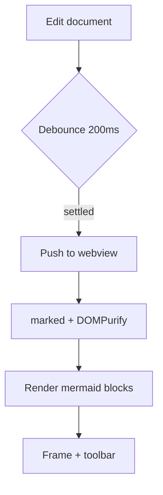
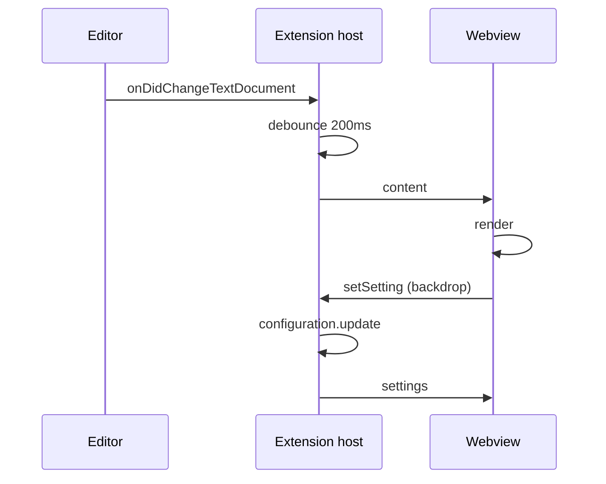

# Preview demo

Opened automatically by the `Run Extension` launch configuration. Everything the
automated tests cannot check — Mermaid's actual SVG output, the theme mapping, and
pan/zoom feel — is visible on this page.

## Checklist

1. Diagrams render below (this is the one thing jsdom cannot verify).
2. `Cmd/Ctrl+=` scales **both** the text and the diagrams; `Cmd/Ctrl+0` returns to 100%.
3. Above 100%, drag inside an overflowing diagram to pan.
4. Hover a diagram → **Transparent** / **Backdrop**; the backdrop popover's sliders
   repaint live.
5. Switch VS Code between a light and a dark theme — diagrams must re-render with
   the new palette, not keep the old one.
6. Scroll the editor; this pane should follow.
7. Open `sample/chart.mmd` to see the full-bleed solo layout.

## Text

Regular paragraph with **bold**, *italic*, `inline code`, and a
[link](https://github.com/ilphs/UniNotepad) that should open in a browser.

> A blockquote, for the left border and muted color.

| Column | Type | Note |
| --- | --- | --- |
| `a` | number | tables scroll horizontally when narrow |
| `b` | string | borders follow the theme |

Fenced code is **not** syntax-highlighted in this version — see the README's known
gaps. It should still be monospaced, boxed, and horizontally scrollable:

```ts
export function previewZoomFactor(): number {
  return Math.min(ZOOM_MAX, Math.max(ZOOM_MIN, ZOOM_BASE ** zoomExp()));
}
```

## Diagrams

A flowchart:



A sequence diagram, wide enough to need panning once zoomed in:



A deliberately broken diagram, to confirm the error box rather than a blank pane:

```mermaid
graph TD
  A --> ((((
```
